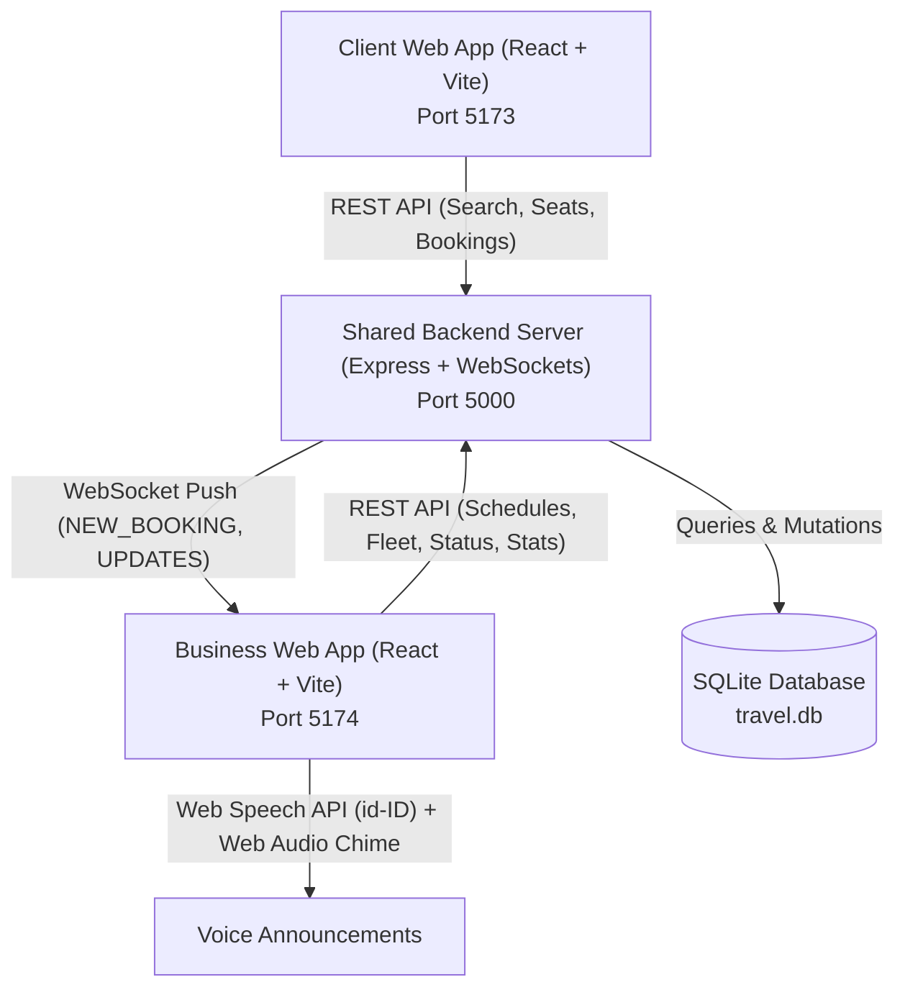

# 🚗 Car Travel & Rental Platform (Travel Pooling) - Comprehensive Documentation

A full-stack, real-time travel pooling platform designed for inter-city shuttle services. It features two responsive web applications (**Client App** for passengers and **Business App** for operators) connected to a shared Node.js backend and SQLite database with WebSockets and Indonesian Text-to-Speech voice alerts.

---

## 📑 Table of Contents
1. [System Architecture](#-system-architecture)
2. [Folder & Directory Structure](#-folder--directory-structure)
3. [Database Schema (SQLite)](#-database-schema-sqlite)
4. [Backend API Reference](#-backend-api-reference)
5. [Client Application Features](#-client-application-features)
6. [Business Operator Application Features](#-business-operator-application-features)
7. [Fleet (Armada) & Custom Seat Layout Engine](#-fleet-armada--custom-seat-layout-engine)
8. [Voice Notification & WebSocket System](#-voice-notification--websocket-system)
9. [Getting Started & Operational Guide](#-getting-started--operational-guide)
10. [Troubleshooting & Maintenance](#-troubleshooting--maintenance)

---

## 🏛 System Architecture

The platform uses a decoupled three-tier architecture:



- **Client App (`client/`)**: Mobile & desktop web app for passengers to search routes, inspect seat layouts, choose departure times, and reserve seats with payment on arrival.
- **Business App (`business/`)**: Desktop & tablet/mobile dashboard for dispatchers and operators. Includes hands-free Indonesian voice notifications, live order check-ins, custom fleet layout editor, and analytics.
- **Server (`server/`)**: Express REST API and WebSocket hub, persisting data to `travel.db` via `sqlite3`.

---

## 📁 Folder & Directory Structure

```
Car - Travel and Rental/
├── client/                              # Passenger Booking Web App (Port 5173)
│   ├── index.html
│   ├── package.json
│   ├── vite.config.js                   # Proxy /api -> http://localhost:5000
│   └── src/
│       ├── components/
│       │   ├── AuthModal.jsx            # Phone (OTP), Email, Google auth + Name
│       │   ├── InteractiveSeatMap.jsx   # Dynamic cabin seat layout renderer
│       │   └── TicketPass.jsx           # Digital Boarding Pass with QR & directions
│       ├── App.jsx                      # Main passenger flow & 'Tiket Saya' drawer
│       ├── utils.js                     # formatIDR() & formatDateID()
│       └── index.css                    # Tailwind CSS imports
│
├── business/                            # Operator Admin Dashboard (Port 5174)
│   ├── index.html
│   ├── package.json
│   ├── vite.config.js                   # Proxy /api -> http://localhost:5000
│   └── src/
│       ├── components/
│       │   ├── ScheduleModal.jsx        # Schedule modal with Armada picker
│       │   └── ArmadaModal.jsx          # Interactive cabin layout editor (Rows x Cols)
│       ├── App.jsx                      # Tabs: Orders, Schedules, Armadas, Analytics
│       ├── voiceNotifier.js             # Web Audio chime + SpeechSynthesis (id-ID)
│       ├── utils.js                     # formatIDR() & formatDateID()
│       └── index.css                    # Tailwind CSS imports
│
├── server/                              # Shared Backend & SQLite Database (Port 5000)
│   ├── package.json
│   ├── travel.db                        # SQLite database file
│   ├── test_integration.py             # Integration test script
│   └── src/
│       ├── db.js                        # Database init, migrations & prototype seeding
│       └── server.js                    # Express endpoints & WebSocket broadcaster
│
├── start_all.bat                        # 1-Click launcher starting all 3 servers
├── Client App (Passenger).url           # Browser shortcut to http://localhost:5173
├── Business App (Operator).url          # Browser shortcut to http://localhost:5174
└── README.md                            # High-level overview
```

---

## 💾 Database Schema (SQLite)

Located at `server/travel.db`. Initialized and migrated automatically by `server/src/db.js`.

### 1. `pooling_spots`
Stores physical travel hubs / terminals.
| Column | Type | Description |
|---|---|---|
| `id` | `INTEGER PRIMARY KEY` | Auto-increment identifier |
| `name` | `TEXT` | Terminal name (e.g., `Pool Surabaya`, `Pool Malang`) |
| `city` | `TEXT` | City (e.g., `Surabaya`, `Malang`) |
| `address` | `TEXT` | Street address |
| `phone` | `TEXT` | Terminal contact number |
| `landmark` | `TEXT` | Nearby reference point (e.g., *Dekat Tunjungan Plaza*) |
| `is_active` | `INTEGER` | `1` for active, `0` for inactive |

### 2. `armadas`
Stores vehicles and their custom seating layouts.
| Column | Type | Description |
|---|---|---|
| `id` | `INTEGER PRIMARY KEY` | Auto-increment identifier |
| `name` | `TEXT` | Vehicle model (e.g., `Toyota HiAce Premio`, `Innova Reborn`) |
| `license_plate` | `TEXT` | Vehicle license plate (e.g., `L 7788 AB`) |
| `rows_count` | `INTEGER` | Number of rows in cabin grid |
| `cols_count` | `INTEGER` | Number of columns in cabin grid |
| `layout_json` | `TEXT` | 2D JSON array of cell definitions (`seat`, `aisle`, `driver`, `empty`) |
| `total_seats` | `INTEGER` | Total bookable passenger seats count |
| `is_active` | `INTEGER` | Active status (`1` or `0`) |
| `created_at` | `DATETIME` | Timestamp |

### 3. `schedules`
Stores travel trips with assigned pooling spots, times, fares, and armada.
| Column | Type | Description |
|---|---|---|
| `id` | `INTEGER PRIMARY KEY` | Auto-increment identifier |
| `origin_spot_id` | `INTEGER` | References `pooling_spots(id)` |
| `destination_spot_id` | `INTEGER` | References `pooling_spots(id)` |
| `departure_time` | `TEXT` | Time in 24h format (e.g., `08:30`, `14:00`) |
| `price` | `INTEGER` | Ticket price in IDR (e.g., `95000`) |
| `total_seats` | `INTEGER` | Capacity copied from selected armada |
| `armada_id` | `INTEGER` | References `armadas(id)` |
| `vehicle_model` | `TEXT` | Model name cached for quick display |
| `vehicle_layout` | `TEXT` | JSON layout cached for ticket mapping |
| `is_active` | `INTEGER` | Active booking toggle |

### 4. `bookings`
Stores passenger orders and seat reservations.
| Column | Type | Description |
|---|---|---|
| `id` | `INTEGER PRIMARY KEY` | Auto-increment identifier |
| `booking_code` | `TEXT UNIQUE` | Formatted code (e.g., `TRV-260922-KA12`) |
| `schedule_id` | `INTEGER` | References `schedules(id)` |
| `travel_date` | `TEXT` | Date format `YYYY-MM-DD` |
| `customer_name` | `TEXT` | Full name of passenger |
| `customer_phone` | `TEXT` | Phone / WhatsApp number |
| `customer_email` | `TEXT` | Email address |
| `auth_method` | `TEXT` | `phone`, `email`, or `google` |
| `seat_numbers` | `TEXT` | JSON array of chosen seats, e.g. `["1A", "2B"]` |
| `seats_count` | `INTEGER` | Count of seats booked |
| `price_per_seat` | `INTEGER` | Base fare per seat in IDR |
| `total_price` | `INTEGER` | `price_per_seat * seats_count` |
| `payment_method` | `TEXT` | Defaults to `'Bayar di Tempat (Pool)'` |
| `payment_status` | `TEXT` | `'PENDING'`, `'PAID'`, `'CANCELLED'` |
| `booking_status` | `TEXT` | `'CONFIRMED'`, `'COMPLETED'`, `'CANCELLED'` |
| `created_at` | `DATETIME` | Booking timestamp |

---

## 🔌 Backend API Reference

Base URL: `http://localhost:5000`

### Public / Client Endpoints
- **`GET /api/spots`**
  - Returns list of active pooling spots.
- **`GET /api/schedules?origin={id}&destination={id}&date={YYYY-MM-DD}`**
  - Returns schedules for a route on a given date, calculating booked seats and remaining availability.
- **`GET /api/schedules/:id?date={YYYY-MM-DD}`**
  - Detailed single schedule view with current booked seat numbers.
- **`POST /api/bookings`**
  - Creates a new booking. Validates collision to prevent double-booking.
  - Emits real-time `NEW_BOOKING` event across active WebSockets.
  - **Payload**:
    ```json
    {
      "schedule_id": 1,
      "travel_date": "2026-09-22",
      "customer_name": "Rian Pratama",
      "customer_phone": "+62 812-9999-1122",
      "customer_email": "rian@example.com",
      "auth_method": "phone",
      "seat_numbers": ["2A", "2B"]
    }
    ```
- **`GET /api/bookings/lookup?phone={number}&code={code}`**
  - Look up ticket history by passenger phone number or booking code.

### Business Operator Endpoints
- **`GET /api/business/bookings`**
  - Optional filters: `?date=YYYY-MM-DD&payment_status=PENDING`
- **`GET /api/bookings/lookup`**
  - Searches passenger bookings by `code=TRV-...` or `phone=0812...`.
- **`POST /api/bookings/:id/cancel`**
  - Allows passengers to cancel their booking.
  - Updates status to `CANCELLED`, releases reserved seats, and notifies operators via WebSocket.
- **`PATCH /api/business/bookings/:id/status`**
  - Updates `payment_status` (`PAID`, `PENDING`) and/or `booking_status` (`COMPLETED`, `CANCELLED`).
- **`GET /api/armadas`**
  - Returns all registered fleet vehicles with layouts.
- **`POST /api/armadas`**
  - Adds a new armada with grid dimensions and interactive cell layout.
- **`PUT /api/armadas/:id`**
  - Updates an existing armada's name, license plate, grid dimensions, and cabin seat layout. Automatically syncs updated capacity and layout to schedules assigned to this armada.
- **`DELETE /api/armadas/:id`**
  - Removes an armada and unlinks it from active schedules.
- **`GET /api/business/schedules`**
  - Returns all schedules with joined terminal and armada details.
  - Supports query parameter `?date=YYYY-MM-DD` (defaults to current date).
  - Calculates real-time `booked_seats_count` and `remaining_seats` based on confirmed passenger bookings for the selected date.
- **`POST /api/business/schedules`**
  - Creates a new schedule linking route, departure time, fare, and armada.
- **`PUT /api/business/schedules/:id`**
  - Modifies price, time, capacity, armada, or active status.
- **`DELETE /api/business/schedules/:id`**
  - Menghapus jadwal perjalanan.
  - Jika jadwal memiliki pesanan aktif (`booking_status != 'CANCELLED'`), server merespons `400 Bad Request` dengan pesan detail yang menjelaskan jumlah pesanan aktif.
  - Jika tidak ada pesanan aktif, membersihkan riwayat pesanan yang dibatalkan dan menghapus jadwal dari database.
- **`GET /api/business/analytics`**
  - Summary stats: Total bookings, paid revenue, pending revenue, passengers, top routes, and hourly traffic.

---

## 👤 Client Application Features

- **Responsive Viewport**: Fluid UI optimized for smartphones (PWA-friendly) and wide desktop screens.
- **Authentication Modal (`AuthModal.jsx`)**:
  - Support for **Phone (OTP simulation)**, **Email**, or **Google Sign-In**.
  - Name collection step to automatically personalize boarding passes.
- **Trip Search**:
  - **Validasi Rute Bertahap (Departure First)**:
    - Dropdown Pool Keberangkatan (Asal) selalu aktif (*enabled*) agar penumpang menentukan titik berangkat terlebih dahulu.
    - Dropdown Pool Kedatangan (Tujuan) berstatus *disabled* dengan pesan panduan sampai pool asal dipilih.
    - Opsi pool yang sama dengan pool keberangkatan otomatis dinonaktifkan (*disabled: "(Sama dengan asal)"*) pada pilihan tujuan untuk mencegah rute melingkar/tidak valid.
  - Date picker with past date prevention.
- **Schedule Selection**:
  - Cards indicating departure time, vehicle model, and real-time seat counts.
  - "Penuh" badge if all seats are occupied.
  - Warning banner when no trips are scheduled on the selected date.
- **Interactive Seat Map (`InteractiveSeatMap.jsx`)**:
  - Visual car cabin representation displaying the driver, aisles, available seats, booked seats (grayed out), and passenger selection.
  - Real-time price counter updating as seats are toggled.
- **Pay on Arrival Workflow**:
  - Confirmation highlighting zero upfront cost (*"Bayar saat tiba di pool keberangkatan"*).
- **Digital Boarding Pass (`TicketPass.jsx`)**:
  - Unique booking reference code.
  - High-contrast SVG QR Code for on-site check-in scanning.
  - Penanganan Status Pembatalan: Tiket yang dibatalkan menampilkan header merah *"Tiket Dibatalkan"*, badge status merah *"Dibatalkan"*, keterangan pembatalan (tidak perlu membayar), serta QR Code yang dinonaktifkan (tanda Batal).
  - Pool departure and destination address guidance.
- **Tiket Saya History**:
  - Persistent access to previous and active tickets stored under the user's phone session.
  - Menampilkan status tiket terkini secara akurat (`Sudah Lunas`, `Menunggu Bayar di Pool`, atau `Dibatalkan`).
  - **Fitur Batalkan Tiket Mandiri**: Penumpang dapat membatalkan tiket langsung dari daftar **Tiket Saya** atau dari detail **Boarding Pass (TicketPass)** selama tiket belum berstatus selesai/check-in.
  - Pembatalan tiket akan secara otomatis melepaskan kursi yang dipesan ke publik dan menyiarkan pembaruan real-time ke aplikasi Business via WebSocket.
  - Tiket yang dibatalkan ditampilkan dengan efek strikethrough dan badge merah agar penumpang mengetahui bahwa pesanan tidak lagi aktif.

---

## 🏢 Business Operator Application Features

- **Live WebSocket Feed**: Connects immediately on boot to receive real-time order dispatches without page reloads.
  - **Sinkronisasi Otomatis Seluruh Tab**: Saat ada pesanan baru (`NEW_BOOKING`) atau pembaruan status pesanan (`BOOKING_UPDATED`), aplikasi secara otomatis memperbarui daftar pesanan, statistik omset, dan **sisa kursi pada Manajemen Jadwal & Tarif** secara instan tanpa perlu refresh halaman.
- **Indonesian Voice Announcer**:
  - Plays a gentle dual-frequency audio chime followed by natural Indonesian speech synthesis for new orders.
  - Announcing new orders: *"Pesanan baru dari Pool [Asal] ke [Tujuan]. Pemesan [Nama], [Jumlah] kursi, keberangkatan pukul [Jam]"*.
  - Plays warning chime & audio announcement for cancellations: *"Perhatian: Pesanan [Kode] atas nama [Nama] rute [Asal] ke [Tujuan] telah dibatalkan."*
  - Audio mute switch and sound test button.
- **Order Management Tab**:
  - **Filter Pesanan Fleksibel**: Filter berdasarkan Tanggal Keberangkatan, Status Pembayaran (`Menunggu Bayar`, `Sudah Lunas`, `Batal Bayar`), dan Status Perjalanan (`Terkonfirmasi`, `Selesai`, `Dibatalkan`).
  - **Tampilan Pesanan Dibatalkan**: Pesanan yang dibatalkan tetap tercatat di sistem dengan badge merah *"Dibatalkan"* dan efek *strikethrough* untuk transparansi audit.
  - **Terima Bayar di Pool**: One-click action when the customer arrives and pays at the ticket counter.
  - **Check-in Armada**: Confirms passenger boarding.
  - **Batalkan Pesanan**: Cancels order and releases seats back to the public pool with user confirmation.
- **Schedules & Pricing Tab**:
  - Schedule creator with automatic Armada selection.
  - Date picker filter untuk memantau kapasitas dan sisa kursi secara real-time per tanggal keberangkatan.
  - Format status kapasitas informatif: misal `10 Kursi (Sisa 7)` dengan indikator warna (hijau, amber, merah).
  - Quick fare adjustments in IDR.
  - Active/Inactive toggle per trip.
- **Manajemen Armada Tab**:
  - Visual seat layout grid builder (Innova, HiAce, Elf, Bus) dan pengaturan plat nomor.
- **Timeline dan Alur Waktu Pesanan Tab**:
  - Terletak tepat di antara tab **Manajemen Armada** dan tab **Statistik & Laporan**.
  - **Audit Trail Real-Time**: Merekam urutan waktu setiap kejadian siklus pesanan (`ORDER_PLACED`, `PAYMENT_RECEIVED`, `PASSENGER_CHECKED_IN`, `ORDER_CANCELLED`).
  - **Transparansi Aktor**: Menampilkan siapa yang melakukan aksi (Pelanggan, Operator Pool, atau Sistem).
  - **Sinkronisasi Otomatis**: Timeline otomatis ter-update saat ada pesanan baru atau pembaruan status tanpa refresh.
  - **Filter Komprehensif**: Filter pencarian teks bebas (kode booking, nama, telepon), filter tipe peristiwa, dan filter tanggal peristiwa.
- **Statistik & Laporan Tab**:
  - Revenue breakdown: Paid Revenue (`PAID`) vs Pending Revenue (`PENDING`).
  - Total Booking volume and seat count.
  - Top 5 performing routes and hourly booking density.

---

## 🚐 Fleet (Armada) & Custom Seat Layout Engine

The platform includes a flexible layout builder allowing operators to configure any vehicle size (Innova, HiAce, Elf, Medium Bus):

### 1. Grid Configuration (`ArmadaModal.jsx`)
Operators specify:
- Vehicle Model Name & License Plate.
- Dimensions: **2 to 7 Rows** × **2 to 5 Columns**.

### 2. Cell Cycle States
Clicking any cell in the visual vehicle editor cycles its type:
```
[Kursi (Passenger Seat)] ➔ [Lorong (Aisle)] ➔ [Kosong (Empty Space)] ➔ [Supir (Driver)]
```
- **Seats**: Auto-labeled with row and column identifiers (e.g. `1A`, `2B`, `3C`).
- **Capacity**: The modal automatically counts `type === 'seat'` cells to compute total passenger capacity.

### 3. Rendering in Client
When a schedule using an armada is selected by a passenger, the client's `InteractiveSeatMap.jsx` dynamically receives `schedule.vehicle_layout` and renders the exact customized cabin layout configured by the operator.

---

## 🔊 Voice Notification & WebSocket System

### Implementation (`business/src/voiceNotifier.js`)
1. **Audio Chime**: Uses the browser's native `AudioContext` to generate a warm two-tone harmonic transition:
   - Primary: $659.25\text{ Hz}$ ($E_5$) $\to 987.77\text{ Hz}$ ($B_5$)
   - Secondary: Triangle wave for gentle warmth with exponential gain decay.
2. **Indonesian Speech Synthesis**:
   - Uses `window.speechSynthesis`.
   - Locale set to `id-ID`.
   - Scans system voices for native Indonesian speaker voices.
3. **Autoplay Compliance**:
   - Modern browsers restrict audio until the user interacts with the page.
   - The UI includes an explicit **"Uji Notifikasi Suara"** button and voice toggle that unlocks audio playback permissions smoothly.

---

## 🚀 Getting Started & Operational Guide

### Prerequisites
- Node.js (v18 or newer recommended, tested on v24).
- NPM (v10+).
- Python (v3.10+ for running automated test scripts).

### Quick Start (Windows)
Double-click **`start_all.bat`** in the project root folder.
This launches:
1. Backend server on port `5000`.
2. Client app on port `5173`.
3. Business dashboard on port `5174`.

### Manual Start via Terminal
Open 3 separate terminal tabs:

```cmd
:: Terminal 1 - Backend Server
cd server
npm start

:: Terminal 2 - Client App
cd client
cmd /c "npm run dev"

:: Terminal 3 - Business App
cd business
cmd /c "npm run dev"
```

### Access URLs & Shortcuts
- **Client (Passenger)**: `http://localhost:5173` or double-click `Client App (Passenger).url`
- **Business (Operator)**: `http://localhost:5174` or double-click `Business App (Operator).url`
- **REST & WebSocket API**: `http://localhost:5000`

---

## 🛠 Troubleshooting & Maintenance

### 1. Port Conflicts (e.g., Port 5000 or 5174 in use)
If a process is already running on a required port:
```cmd
netstat -ano | findstr :5000
taskkill /F /PID <PID_NUMBER>
```

### 2. Resetting Prototype Database
To re-seed fresh sample data (Pool Surabaya & Pool Malang with default armadas and schedules):
```cmd
cd server
node -e "import('./src/db.js').then(m => m.initDb())"
```

### 3. Automated Integration Test
Verify all backend booking and analytics endpoints in one command:
```cmd
python server/test_integration.py
```
Expected output:
```
1. Spots count: 2
2. Schedules count: 7, Price: Rp 95,000, Available Seats: 8
3. Booking created successfully! Code: TRV-XXXX-XXXX
4. Analytics updated: Total Bookings > 0
```
