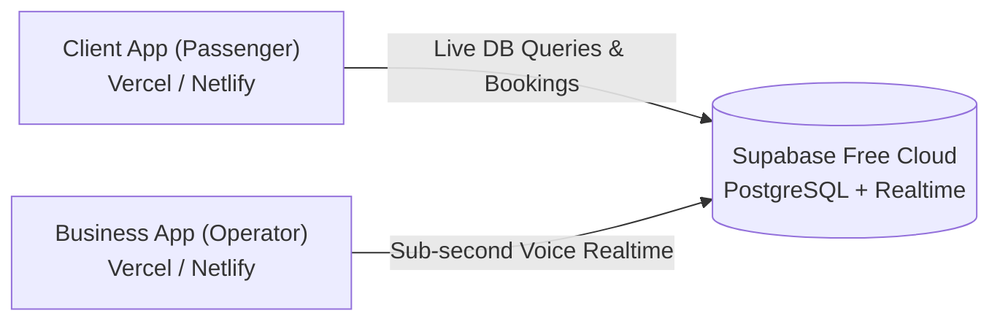

# 🌐 Supabase + Vercel/Netlify Deployment Guide (100% Free - NO Credit Card)

Welcome! With our new cloud architecture, **there is NO backend server to host**!
- **Database + Real-time WebSockets**: Handled by **Supabase** (Free cloud PostgreSQL + instant Realtime).
- **Web Applications**: Both the **Client App (Passenger)** and **Business App (Operator)** deploy directly to **Vercel** or **Netlify** in 1 click.

Everything is **100% Free** with **ZERO Credit Card Required**.

---

## 📋 Architecture Overview



---

## 🚀 STEP 1: Set Up Free Supabase Database (2 Minutes)

1. Open [**supabase.com**](https://supabase.com) and click **Start your project** (Sign in with **GitHub** — **No credit card**).
2. Click **New Project**:
   - **Name:** `antarpool-travel`
   - **Database Password:** Enter any strong password (or click generate).
   - **Region:** Choose Singapore (`Southeast Asia (Singapore)`) for fastest speeds in Indonesia.
   - Click **Create new project** and wait ~1 minute for it to finish provisioning.
3. Open the **SQL Editor** on the left menu (icon: `>_`).
4. Click **New query** (or open empty editor).
5. Open [`deploy/supabase_schema.sql`](./supabase_schema.sql) in this project, copy the entire content, paste it into the Supabase SQL Editor, and click **Run** (or `Ctrl + Enter`).
   > 🎉 *This instantly creates all 5 tables (`pooling_spots`, `armadas`, `schedules`, `bookings`, `order_timeline_events`), enables Realtime replication, and seeds Surabaya & Malang routes!*
6. Go to **Project Settings** (gear icon on bottom left) → **API**:
   - Copy **Project URL** (e.g. `https://xyzcompany.supabase.co`).
   - Copy **anon public API Key** (starts with `eyJhbGci...`).

---

## 💻 STEP 2: Commit & Push Code to GitHub

Open your terminal in `Car - Travel and Rental`:
```bash
git add .
git commit -m "feat: migrate to Supabase cloud database and realtime engine"
git push
```

---

## 📱 STEP 3: Deploy Client App (Passenger) to Vercel or Netlify

### Using Vercel (Recommended):
1. Go to [**vercel.com**](https://vercel.com) and log in with GitHub.
2. Click **Add New...** → **Project**.
3. Select your `antarpool-travel` repository.
4. Configure Project:
   - **Project Name:** `antarpool-travel`
   - **Root Directory:** Click edit and select `client`
5. Under **Environment Variables**, add:
   - `VITE_SUPABASE_URL` = *(Your Supabase Project URL from Step 1)*
   - `VITE_SUPABASE_ANON_KEY` = *(Your Supabase anon public key from Step 1)*
6. Click **Deploy**! In 30 seconds your passenger app is live worldwide!

---

## 🏢 STEP 4: Deploy Business App (Operator) to Vercel or Netlify

1. In Vercel, click **Add New...** → **Project** again.
2. Select the same `antarpool-travel` repository.
3. Configure Project:
   - **Project Name:** `antarpool-operator`
   - **Root Directory:** Click edit and select `business`
4. Under **Environment Variables**, add:
   - `VITE_SUPABASE_URL` = *(Your Supabase Project URL)*
   - `VITE_SUPABASE_ANON_KEY` = *(Your Supabase anon public key)*
   - *(Optional)* `VITE_OPERATOR_USER` = `admin`
   - *(Optional)* `VITE_OPERATOR_PASS` = `antarpool2026`
5. Click **Deploy**! Your operator dashboard is live!

---

## ✅ Live Verification Checklist

- [ ] **Operator Security:** Open the Business App. Verify the Login Gate appears. Log in with `admin` / `antarpool2026`.
- [ ] **Realtime Indicator:** Look at the top bar; it will show **"Live WebSocket Aktif"** connected via Supabase Realtime!
- [ ] **Book a Ticket:** Open the Client App on your phone, choose seats, and book.
- [ ] **Instant Voice Announcer:** The operator dashboard immediately chimes and speaks the Indonesian voice announcement in sub-second real time!
- [ ] **Supabase Dashboard:** Open Supabase → Table Editor → `bookings`. You can see every booking row live!
