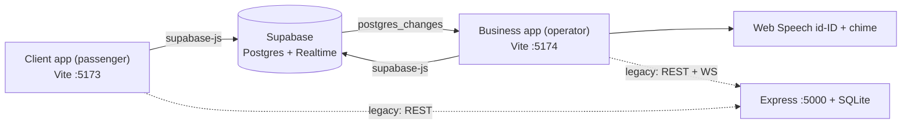

# Architecture

## Two runtime modes

Both frontends contain a data layer (`src/api.js`) that picks a backend **at build/start time**:

```js
if (isSupabaseConfigured) { /* talk directly to Supabase */ }
else { fetch(`${VITE_API_URL}/api/...`) }   // legacy Express server
```

`isSupabaseConfigured` is true when both `VITE_SUPABASE_URL` and `VITE_SUPABASE_ANON_KEY` are set (`src/supabase.js`).

| | **Supabase mode (current / production)** | **Legacy mode (local prototype)** |
|---|---|---|
| Database | Supabase PostgreSQL ([schema](../deploy/supabase_schema.sql)) | SQLite `server/travel.db` |
| Business logic | In the browser (`api.js`) | In `server/src/server.js` |
| Realtime | Supabase Realtime `postgres_changes` | `ws` WebSocket on port 5000 |
| Hosting | Vercel/Netlify static sites + Supabase | `node server/src/server.js` |



> [!WARNING]
> The two modes are **not feature-identical**. Supabase mode is the maintained path. Because logic is duplicated (client-side vs. `server.js`), any behavior change must be made in both or the legacy server should be retired (see [ROADMAP.md](ROADMAP.md)). Example drift: `server/test_integration.py` assumes pool ids/cities (Senayan, Dipatiukur) that no longer exist in the seed data.

## Code map

```
client/                       Passenger app (React 19, Vite, Tailwind 4, lucide-react)
  src/App.jsx                 Search → schedule → seat map → booking → "Tiket Saya" drawer
  src/api.js                  getSpots, getSchedules, createBooking, lookupBookings, cancelBooking
  src/supabase.js             Supabase client + isSupabaseConfigured flag
  src/utils.js                formatIDR, formatDateID
  src/components/
    AuthModal.jsx             Phone/Email/Google "login" (simulated; stores travel_user in localStorage)
    InteractiveSeatMap.jsx    Renders armada layout grid, handles seat toggling
    TicketPass.jsx            Boarding pass, QR, cancel button
    ErrorBoundary.jsx
business/                     Operator app (same stack)
  src/App.jsx                 Tabs: Orders, Schedules, Armada, Timeline, Analytics; realtime subscriptions
  src/api.js                  Bookings, schedules, armadas, timeline, analytics
  src/voiceNotifier.js        Chime (Web Audio) + SpeechSynthesis (id-ID)
  src/components/
    LoginGate.jsx             Operator login (client-side credential check)
    ScheduleModal.jsx         Create/edit schedule with armada picker
    ArmadaModal.jsx           Seat grid editor (2–7 rows × 2–5 cols)
    OrderTimeline.jsx         Audit trail view with filters
server/                       Legacy Express + SQLite + ws (db.js seeds data, server.js routes)
deploy/                       supabase_schema.sql, env templates, check_ready.bat, deployment guide
```

## Key flows

**Booking (client `createBooking`)**
1. Read non-cancelled bookings for `(schedule_id, travel_date)`; reject if any chosen seat is taken.
2. Read schedule for price; compute `total_price = price × seats`.
3. Generate code `TRV-<yymmdd>-<4 random chars>`; insert booking (`PENDING`/`CONFIRMED`).
4. Insert `ORDER_PLACED` timeline event (failure swallowed).
5. Business app receives INSERT via Supabase Realtime → chime + voice + list refresh.

**Operator status changes (`updateBookingStatus`)**: updates `payment_status`/`booking_status` and writes a matching timeline event (`PAYMENT_RECEIVED`, `PASSENGER_CHECKED_IN`, `ORDER_CANCELLED`).

**Seat availability** is *derived*, never stored: capacity minus seats in non-cancelled bookings for that date. Schedules are recurring daily templates (time + price + vehicle); a trip instance is `schedule × travel_date`.

**Sessions**
- Passenger: `localStorage.travel_user` (`{name, phone/email, method}`); “Tiket Saya” queries by `customer_phone`.
- Operator: `localStorage`/`sessionStorage` key `antarpool_operator_auth`.

## Seat layout format

`armadas.layout_json` / `schedules.vehicle_layout`: array of rows, each an array of cells
`{ "type": "seat" | "aisle" | "empty" | "driver", "label": "1A" }`. Seat labels are the booking identifiers stored in `bookings.seat_numbers`. The layout is **copied** onto the schedule when an armada is assigned (denormalized); editing an armada must re-sync schedules (legacy server does this; the Supabase path in `saveArmada` does **not**—see ROADMAP).
