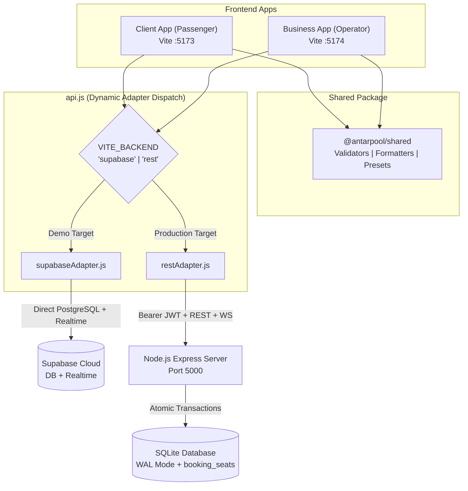

# Architecture

## Two Targeted Deployments

AntarPool explicitly separates two operational targets using a unified codebase and the **Adapter Pattern**:

1. **Demo Target (Supabase / Vercel / Netlify):** Zero-cost serverless prototype for public showcase. Uses Supabase PostgreSQL directly via `@supabase/supabase-js` and Supabase Realtime for order alerts. Includes a hybrid fallback mechanism if dedicated CRM tables are not yet migrated in Supabase.
2. **Production Target (Custom Server / Self-Hosted):** High-reliability target with server-enforced business rules, JWT authentication, atomic concurrency locks, and payment/webhook readiness. Uses `server/src/server.js` (Express + SQLite with WAL mode + WebSockets) organized into modular route controllers and middleware.



## The Adapter Pattern (`src/api.js`)

Each application (`client/` and `business/`) exposes a unified data interface through `src/api.js`. The active adapter is selected at startup/build time:

```javascript
import * as supabaseAdapter from './adapters/supabaseAdapter';
import * as restAdapter from './adapters/restAdapter';
import { isSupabaseConfigured } from './supabase';

const configuredBackend = import.meta.env.VITE_BACKEND;
const activeBackend = configuredBackend
  ? configuredBackend.toLowerCase()
  : (isSupabaseConfigured ? 'supabase' : 'rest');

export const adapter = activeBackend === 'supabase' ? supabaseAdapter : restAdapter;
```

Both adapters adhere to an identical contract and method signatures:
- In `client/`: `getSpots()`, `getSchedules(...)`, `createBooking(...)`, `lookupBookings(...)`, `cancelBooking(...)`, `updateProfile(...)`
- In `business/`: `getBusinessBookings(...)`, `getArmadas()`, `getSpots()`, `getBusinessSchedules(...)`, `updateBookingStatus(...)`, `saveSchedule(...)`, `deleteSchedule(...)`, `saveArmada(...)`, `deleteArmada(...)`, `getTimeline()`, `getAnalytics()`, `getCustomers()`, `updateCustomer(...)`

## Code Map

```
antarpool-travel/
├── package.json              # Monorepo root with npm workspaces (client, business, server, shared)
├── tests/
│   └── contract.test.js      # Automated contract & concurrency test suite (Node test runner, 9 tests)
├── shared/                   # Shared monorepo package (@antarpool/shared)
│   └── src/index.js          # Shared IDR/date formatters, phone normalizer, NIK & email validators
├── client/                   # Passenger Booking Web App (Port 5173)
│   ├── src/
│   │   ├── adapters/
│   │   │   ├── supabaseAdapter.js
│   │   │   └── restAdapter.js
│   │   ├── api.js            # Unified contract dispatcher
│   │   ├── components/
│   │   │   ├── ClientHeader.jsx    # Responsive brand header, 'Tiket Saya', Profile & Auth pill
│   │   │   ├── SearchHero.jsx      # Origin/Destination selector & date picker hero card
│   │   │   ├── MyBookingsModal.jsx # Passenger ticket lookup drawer & cancellation
│   │   │   ├── InteractiveSeatMap.jsx
│   │   │   ├── TicketPass.jsx
│   │   │   ├── AuthModal.jsx
│   │   │   └── ProfileModal.jsx    # Domicile city & 16-digit NIK profile management
│   │   └── App.jsx           # Clean coordinator shell (< 350 LOC)
├── business/                 # Operator Admin Dashboard (Port 5174)
│   ├── src/
│   │   ├── adapters/
│   │   │   ├── supabaseAdapter.js
│   │   │   └── restAdapter.js
│   │   ├── api.js            # Unified contract dispatcher
│   │   ├── components/
│   │   │   ├── Navbar.jsx          # Top brand bar, connection indicator, voice controls, tabs
│   │   │   ├── ToastContainer.jsx  # Floating alert & Indonesian voice announcement toasts
│   │   │   ├── tabs/
│   │   │   │   ├── OrdersTab.jsx    # Live bookings stream, status filters, payment verification
│   │   │   │   ├── SchedulesTab.jsx # Timetable, live seat remaining per date, trip editor
│   │   │   │   ├── ArmadasTab.jsx   # Fleet list & interactive cabin layout preview
│   │   │   │   ├── CustomersTab.jsx # CRM directory, VIP/blacklisted chips, WhatsApp links
│   │   │   │   └── AnalyticsTab.jsx # Revenue KPIs, top routes, departure distributions
│   │   │   ├── OrderTimeline.jsx   # Real-time lifecycle audit trail
│   │   │   ├── LoginGate.jsx       # Authenticates against /api/business/login in REST mode
│   │   │   ├── ScheduleModal.jsx
│   │   │   ├── ArmadaModal.jsx
│   │   │   ├── CustomerModal.jsx   # CRM customer editor & ticket history drawer
│   │   │   └── ConnectionModal.jsx # Live connection inspector & SQL guide modal
│   │   ├── voiceNotifier.js        # Indonesian Web Speech + audio chime
│   │   └── App.jsx                 # Clean coordinator shell (< 450 LOC)
├── server/                   # Production Layered Backend Server (Port 5000)
│   ├── src/
│   │   ├── config/
│   │   │   └── env.js        # Environment configuration defaults (PORT, DB_PATH, JWT_SECRET)
│   │   ├── middleware/
│   │   │   └── auth.js       # JWT generation and requireOperator middleware
│   │   ├── routes/
│   │   │   ├── auth.js       # POST /api/business/login
│   │   │   ├── spots.js      # /api/spots
│   │   │   ├── schedules.js  # /api/schedules, /api/business/schedules
│   │   │   ├── armadas.js    # /api/armadas
│   │   │   ├── bookings.js   # /api/bookings, atomic reservations & cancellations
│   │   │   ├── customers.js  # /api/customers/profile, /api/business/customers
│   │   │   ├── analytics.js  # /api/business/analytics
│   │   │   └── timeline.js   # /api/business/timeline
│   │   ├── websocket.js      # WebSocket server hub & broadcastToBusiness
│   │   ├── db.js             # SQLite WAL mode, withTransaction mutex, booking_seats table
│   │   └── server.js         # Lean main entrypoint (82 LOC)
│   ├── test_integration.py   # Python integration test script
│   └── travel.db             # Local SQLite database
└── docs/                     # Documentation suite
```

## Atomic Booking & Seat Collision Model

Double booking is prevented at the database level in both targets:
1. **`booking_seats` Table:** Stores one row per reserved seat (`schedule_id`, `travel_date`, `seat_number`, `status`).
2. **Partial Unique Index:** `UNIQUE(schedule_id, travel_date, seat_number) WHERE status != 'CANCELLED'`.
3. **Supabase Concurrency Handling:** Caught PostgreSQL error code `23505` on `idx_supabase_unique_active_seat` with automatic rollback of conflicting bookings.
