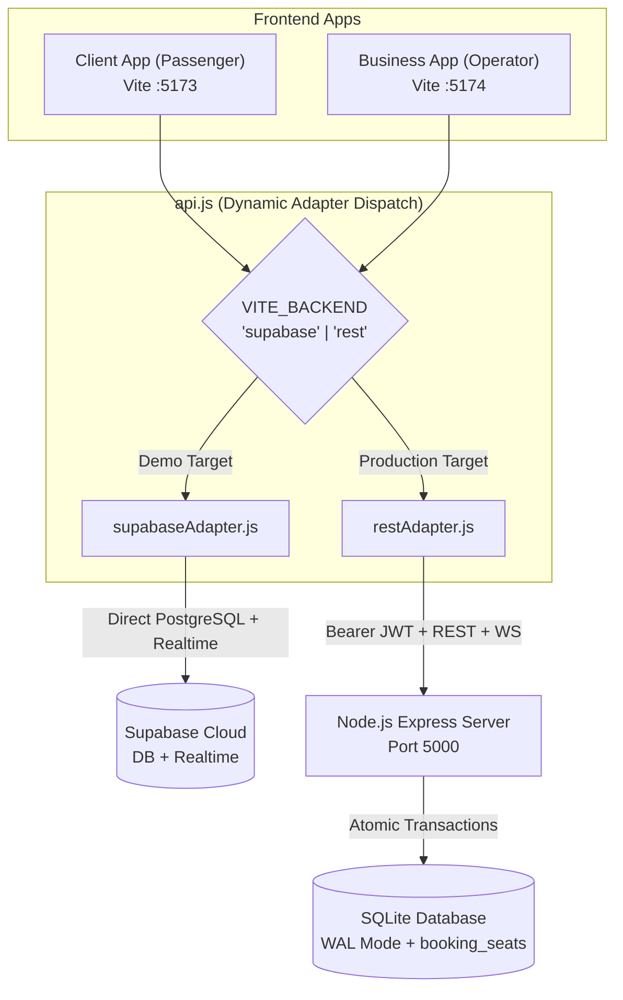

# Architecture

## Two Targeted Deployments

AntarPool explicitly separates two operational targets using a unified codebase and the **Adapter Pattern**:

1. **Demo Target (Supabase / Vercel / Netlify):** Zero-cost serverless prototype for public showcase. Uses Supabase PostgreSQL directly via `@supabase/supabase-js` and Supabase Realtime for order alerts.
2. **Production Target (Custom Server / Self-Hosted):** High-reliability target with server-enforced business rules, JWT authentication, atomic concurrency locks, and payment/webhook readiness. Uses `server/src/server.js` (Express + SQLite with WAL mode + WebSockets).



## The Adapter Pattern (`src/api.js`)

Each application (`client/` and `business/`) exposes a unified data interface through `src/api.js`. The active adapter is selected at startup/build time:

```javascript
import * as supabaseAdapter from './adapters/supabaseAdapter';
import * as restAdapter from './adapters/restAdapter';
import { isSupabaseConfigured } from './supabase';

const configuredBackend = import.meta.env.VITE_BACKEND;
const activeBackend = configuredBackend
  ? configuredBackend.toLowerCase()
  : (isSupabaseConfigured ? 'supabase' : 'rest');

export const adapter = activeBackend === 'supabase' ? supabaseAdapter : restAdapter;
```

Both adapters adhere to an identical contract and method signatures:
- In `client/`: `getSpots()`, `getSchedules(...)`, `createBooking(...)`, `lookupBookings(...)`, `cancelBooking(...)`
- In `business/`: `getBusinessBookings(...)`, `getArmadas()`, `getSpots()`, `getBusinessSchedules(...)`, `updateBookingStatus(...)`, `saveSchedule(...)`, `deleteSchedule(...)`, `saveArmada(...)`, `deleteArmada(...)`, `getTimeline()`, `getAnalytics()`

## Code Map

```
antarpool-travel/
├── package.json              # Monorepo root with npm workspaces (client, business, server, shared)
├── tests/
│   └── contract.test.js      # Automated contract & concurrency test suite (Node test runner)
├── shared/                   # Shared monorepo package (@antarpool/shared)
│   └── src/index.js          # Shared currency (formatIDR) and date formatters
├── client/                   # Passenger Booking Web App (Port 5173)
│   ├── src/
│   │   ├── adapters/
│   │   │   ├── supabaseAdapter.js
│   │   │   └── restAdapter.js
│   │   ├── api.js            # Unified contract dispatcher
│   │   ├── components/
│   │   │   ├── AuthModal.jsx
│   │   │   ├── InteractiveSeatMap.jsx
│   │   │   └── TicketPass.jsx
│   │   └── App.jsx
├── business/                 # Operator Admin Dashboard (Port 5174)
│   ├── src/
│   │   ├── adapters/
│   │   │   ├── supabaseAdapter.js
│   │   │   └── restAdapter.js
│   │   ├── api.js            # Unified contract dispatcher
│   │   ├── components/
│   │   │   ├── LoginGate.jsx # Authenticates against /api/business/login in REST mode
│   │   │   ├── ScheduleModal.jsx
│   │   │   ├── ArmadaModal.jsx
│   │   │   └── OrderTimeline.jsx
│   │   ├── voiceNotifier.js  # Indonesian Web Speech + audio chime
│   │   └── App.jsx
├── server/                   # Production Backend Server (Port 5000)
│   ├── src/
│   │   ├── db.js             # SQLite WAL mode, withTransaction mutex, booking_seats table
│   │   └── server.js         # Express REST API, JWT auth, requireOperator, atomic bookings, WebSockets
│   ├── test_integration.py   # Python integration test script
│   └── travel.db             # Local SQLite database
└── docs/                     # Documentation suite
```

## Atomic Booking & Seat Collision Model

Double booking is prevented at the database level in both targets:
1. **`booking_seats` Table:** Stores one row per reserved seat (`schedule_id`, `travel_date`, `seat_number`, `status`).
2. **Partial Unique Index:** `UNIQUE(schedule_id, travel_date, seat_number) WHERE status != 'CANCELLED'`.
3. **Serialized Locking (`withTransaction`):** In the Node.js production server, an asynchronous mutex synchronizes concurrent booking requests, executing them under `BEGIN IMMEDIATE ... COMMIT`. If any seat is taken or violates the index, a `409 Conflict` status is immediately returned with the colliding seats.
4. **Cancellation:** When an order is cancelled by the passenger or operator, `status` in `booking_seats` is updated to `'CANCELLED'`, instantaneously releasing the seat for re-booking without deleting the audit trail.
