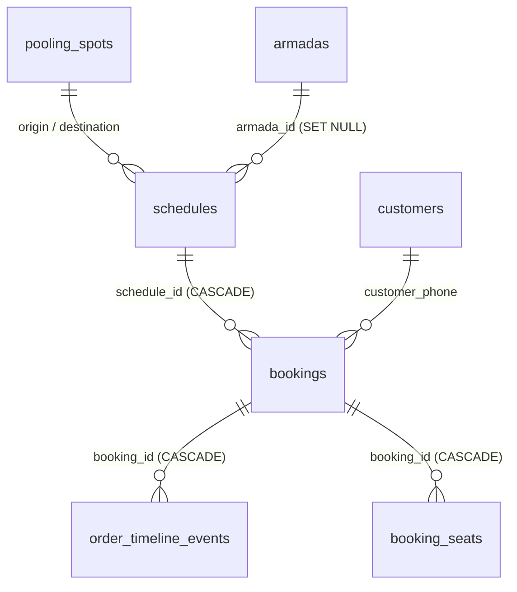

# Database Architecture

The system uses a shared relational model implemented in PostgreSQL ([`deploy/supabase_schema.sql`](../deploy/supabase_schema.sql)) for the Demo target and SQLite (`server/travel.db` initialized via `server/src/db.js`) for the Production target.



## Tables & Schema

### 1. `pooling_spots`
Physical transit terminals and hubs.
- `id`: Primary key (Integer / Bigint)
- `name`: Terminal name (e.g., `Pool Surabaya`, `Pool Malang`)
- `city`: City location (`Surabaya`, `Malang`)
- `address`, `phone`, `landmark`: Contact and guidance
- `is_active`: `1` = active, `0` = disabled

### 2. `armadas`
Vehicles and their cabin grid seat layouts.
- `id`: Primary key
- `name`: Vehicle model (e.g. `Toyota HiAce Premio`, `Toyota Innova Reborn`)
- `license_plate`: Vehicle registration plate (e.g. `L 7788 AB`)
- `rows_count`, `cols_count`: Grid dimensions (e.g. 4 rows × 3 columns)
- `layout_json`: 2D array of cell objects `[ { type: 'seat'|'aisle'|'empty'|'driver', label: '1A' } ]`
- `total_seats`: Total passenger capacity count (`type === 'seat'`)
- `is_active`: Status flag

### 3. `schedules`
Recurring trip templates.
- `id`: Primary key
- `origin_spot_id`, `destination_spot_id`: Terminal references
- `departure_time`: 24-hour time string (`HH:MM`)
- `price`: Ticket price in integer IDR
- `total_seats`: Seat capacity copied from the assigned armada
- `armada_id`: Reference to assigned `armadas(id)`
- `vehicle_model`, `vehicle_layout`: Cached model and seat layout
- `is_active`: Toggle trip visibility

### 4. `bookings`
Passenger travel reservations.
- `id`: Primary key
- `booking_code`: Cryptographically random code (e.g., `TRV-261120-E3A1`)
- `schedule_id`: Trip reference
- `travel_date`: Date string `YYYY-MM-DD`
- `customer_name`, `customer_phone`, `customer_email`, `auth_method`
- `customer_city`: Passenger domicile city (e.g. `Surabaya`)
- `customer_id_card`: Passenger 16-digit Indonesian NIK
- `seat_numbers`: JSON array of booked seats (e.g. `["1A", "2B"]`)
- `seats_count`: Count of seats
- `price_per_seat`, `total_price`: Verified fare
- `payment_method`: Defaults to `'Bayar di Tempat (Pool)'`
- `payment_status`: `'PENDING'`, `'PAID'`, `'CANCELLED'`
- `booking_status`: `'CONFIRMED'`, `'COMPLETED'`, `'CANCELLED'`

### 5. `booking_seats` (Atomic Reservation Table)
Individual seat occupancy records that guarantee collision prevention.
- `id`: Primary key
- `booking_id`: Reference to parent `bookings(id)`
- `schedule_id`: Trip reference
- `travel_date`: Date string `YYYY-MM-DD`
- `seat_number`: Assigned seat label (e.g., `'1A'`)
- `status`: `'CONFIRMED'` or `'CANCELLED'`

**Partial Unique Index:**
```sql
CREATE UNIQUE INDEX idx_unique_active_seat
ON booking_seats(schedule_id, travel_date, seat_number)
WHERE status != 'CANCELLED';
```
- **Guaranteed Uniqueness:** Two active bookings cannot hold the same seat on the same schedule and date.
- **Instant Seat Release:** When an order is cancelled, `status` flips to `'CANCELLED'`. The partial index no longer includes that row, making the seat immediately available for another passenger without losing historical audit trails.

### 6. `order_timeline_events`
Audit trail recording life-cycle events.
- `id`: Primary key
- `booking_id`: Booking reference
- `booking_code`: Human-readable identifier
- `event_type`: `'ORDER_PLACED'`, `'PAYMENT_RECEIVED'`, `'PASSENGER_CHECKED_IN'`, `'ORDER_CANCELLED'`
- `actor_role`: `'CUSTOMER'`, `'OPERATOR'`, `'SYSTEM'`
- `description`: Localized event summary
- `details_json`: Snapshot payload
- `created_at`: Event timestamp

### 7. `customers` (Client App Users CRM)
Directory of passenger accounts and operational CRM attributes.
- `id`: Primary key
- `phone`: Unique identifier / WhatsApp contact (Indexed)
- `name`: Passenger full name
- `email`: Passenger email (optional)
- `city`: Domicile city (e.g. `Surabaya`, `Malang`, `Sidoarjo`)
- `id_card`: 16-digit Indonesian National ID (NIK)
- `auth_method`: Authentication provider (`'phone'`, `'email'`, `'google'`)
- `is_vip`: Boolean flag (1/0) indicating VIP passenger status
- `is_blacklisted`: Boolean flag (1/0) indicating repeat no-show or problematic booking history
- `notes`: Custom operator dispatch and preference notes
- `created_at`: Registration timestamp
- `updated_at`: Last modification timestamp

## State Transitions

```
[ORDER_PLACED]       PENDING / CONFIRMED
       │
       ├─► (Operator marks payment) ──► PAID / CONFIRMED
       │                                     │
       │                                     └─► (Check-in) ──► PAID / COMPLETED
       │
       └─► (Cancel by user/operator) ──► CANCELLED / CANCELLED  (Seat Released)
```
