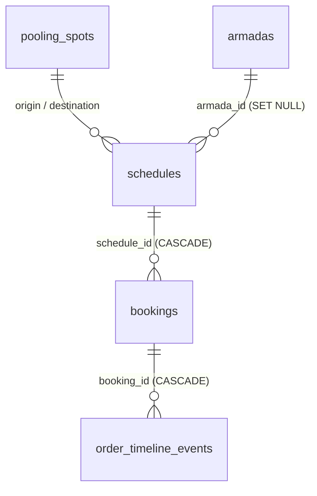

# Database

Source of truth: [`deploy/supabase_schema.sql`](../deploy/supabase_schema.sql) (PostgreSQL). Legacy SQLite is defined in `server/src/db.js` with the same logical model (JSON stored as TEXT).



## Tables

### `pooling_spots`
Terminals. `id`, `name`, `city`, `address`, `phone`, `landmark`, `is_active` (0/1), `created_at`.

### `armadas`
Vehicles with seat layout. `id`, `name`, `license_plate`, `rows_count`, `cols_count`, `layout_json` (JSONB, see below), `total_seats`, `is_active`, `created_at`.

### `schedules`
Recurring daily trip template. `id`, `origin_spot_id`, `destination_spot_id`, `departure_time` (`HH:MM` text), `price` (IDR int), `total_seats`, `armada_id`, `vehicle_model` (cached name), `vehicle_layout` (cached JSONB), `is_active`, `created_at`.

### `bookings`
| Column | Notes |
|---|---|
| `booking_code` | Unique, `TRV-yymmdd-XXXX` |
| `schedule_id`, `travel_date` | Trip instance = schedule × date (`YYYY-MM-DD` text) |
| `customer_name/phone/email`, `auth_method` | `phone` \| `email` \| `google` |
| `seat_numbers` | JSONB array, e.g. `["2A","2B"]`; `seats_count`, `price_per_seat`, `total_price` |
| `payment_method` | Always `Bayar di Tempat (Pool)` |
| `payment_status` | `PENDING` → `PAID`; or `CANCELLED` |
| `booking_status` | `CONFIRMED` → `COMPLETED` (checked in); or `CANCELLED` |

### `order_timeline_events`
Audit trail. `booking_id`, `booking_code`, `event_type` (`ORDER_PLACED`, `PAYMENT_RECEIVED`, `PASSENGER_CHECKED_IN`, `ORDER_CANCELLED`), `actor_role` (`CUSTOMER`/`OPERATOR`/`SYSTEM`), `description` (Indonesian), `details_json`, `created_at`.

## Layout JSON
```json
[
  [{"type":"driver","label":"Supir"},{"type":"empty","label":""},{"type":"seat","label":"1A"}],
  [{"type":"seat","label":"2A"},{"type":"aisle","label":"Lorong"},{"type":"seat","label":"2B"}]
]
```
`total_seats` must equal the number of `seat` cells (computed by `ArmadaModal`, not enforced by the DB).

## State machine
```
PENDING/CONFIRMED --(operator: Terima Bayar)--> PAID/CONFIRMED
PAID/CONFIRMED    --(operator: Check-in)------> PAID/COMPLETED
any non-completed --(customer or operator)----> CANCELLED/CANCELLED   (seats released)
```
Transitions are not validated by the DB (anything can be set to anything); the UI is the only guard.

## Realtime & RLS
- `bookings`, `schedules`, `order_timeline_events` are in the `supabase_realtime` publication. The operator app subscribes to `postgres_changes`.
- RLS is enabled but every policy is `USING (true)` for all roles, including the anonymous key → effectively **no access control** ([SECURITY.md](SECURITY.md)).

## Known schema gaps
- No uniqueness guarantee on `(schedule_id, travel_date, seat)` → double-booking possible under concurrency.
- No indexes beyond PK/`booking_code` (add on `bookings(schedule_id, travel_date)`, `bookings(customer_phone)`).
- No CHECK constraints for statuses; `is_active` should be boolean; `travel_date` should be `DATE`.
- No migrations folder; `schema.sql` is create-only.
- Seed script inserts only HiAce armada schedules (Innova armada seeded but unused); schedule seat total is 8 while the seed label says "10 Seat".
